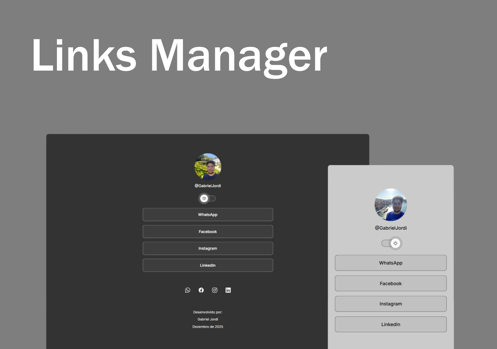

<h1 align="center"> Links Manager </h1>

Gerenciador de links, gratuito, completamente personalizável.

  

 

  

## Tecnologias

Esse projeto foi desenvolvido com as tecnologias:

- HTML e CSS
- JavaScript
- Git e Github

## Projeto

O gerenciador de links é um projeto que possibilita acessar vários links através de uma única página.

---

Desenvolvido por: Gabriel Jordi
 Dezembro de 2025
